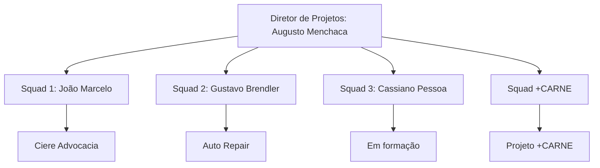

# 🏛️ Estruturação da Diretoria de Projetos — Hut 8 Jr.

Este documento apresenta publicamente o modelo de organização da Diretoria de Projetos, suas responsabilidades e a relação entre diretoria e squads.

> **Última atualização:** 16 de agosto de 2026.

## 👥 Modelo de governança por squads

Os squads possuem autonomia operacional, com acompanhamento da Diretoria de Projetos. A associação a um projeto representa o foco atual ou o histórico do time, não uma limitação de atuação futura.



## 🚀 Estrutura atual

| Squad | Liderança | Composição operacional | Projetos registrados |
| :--- | :--- | :--- | :---: |
| **Squad 1** | João Marcelo | Rodrigo, Victor Reis e Matheus Persch | **1** |
| **Squad 2** | Gustavo Brendler | Pedro Mognon, Pedro Izkovitz, Mariana e Enzo Giacomini | **1** |
| **Squad 3** | Cassiano Pessoa | Pedro Mota, Manoela Viera, Alan Alves e Kenzo Takahashi | **0** |
| **Squad +CARNE** | Governança de Augusto Menchaca | Augusto Molina, Pedro Mota e Pedro Izkovitz | **1** |

Os status de associação e os links dos projetos estão consolidados no [README principal](./README.md).

## 📋 Papéis e atribuições

### Diretor de Projetos

- Coordenar a alocação entre squads e projetos.
- Apoiar líderes na remoção de impedimentos.
- Manter padrões comuns de acompanhamento e qualidade.
- Fazer a interface com as demais diretorias.
- Preservar acesso administrativo transversal quando necessário, sem integrar automaticamente a composição operacional dos squads.

### Líderes de squad

- Organizar o trabalho e facilitar o planejamento do time.
- Manter tarefas, responsáveis e prioridades atualizados.
- Acompanhar riscos e impedimentos.
- Promover revisão colaborativa das entregas.
- Reportar periodicamente a situação do squad à Diretoria de Projetos.

### Diretoria de Marketing

- **Responsável:** Amanda Viera — não possui GitHub.
- Coordenar posicionamento, campanhas, prospecção e comunicação institucional.
- Alinhar materiais públicos com a identidade e os objetivos da Hut 8 Jr.

## ✅ Princípios de entrega

- Mudanças de código devem passar por Pull Request e revisão.
- Critérios de aceite devem estar explícitos nas tarefas.
- Responsividade, acessibilidade, desempenho e segurança devem ser considerados de acordo com o projeto.
- Entregas devem possuir documentação proporcional à sua complexidade.
- Informações comerciais, dados de clientes e materiais confidenciais não devem ser publicados neste repositório.

## 🔄 Ciclo de acompanhamento

```text
Planejamento → Execução → Revisão → Validação → Aprendizados
```

Cada squad pode adaptar sua rotina ao contexto do projeto, preservando transparência, responsabilidade e rastreabilidade das decisões.
